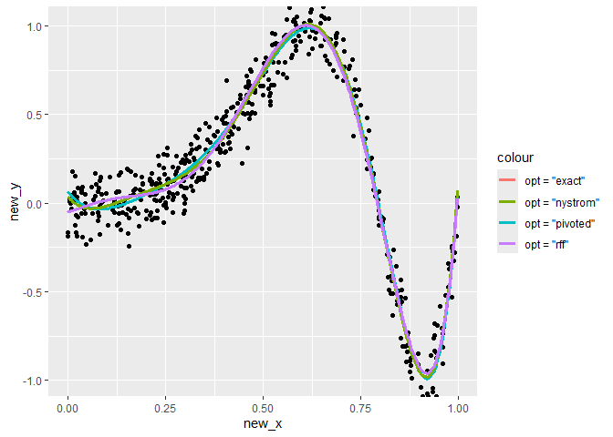

<!-- README.md is generated from README.Rmd. Please edit that file -->

# FastKRR

<!-- badges: start -->

<!-- badges: end -->

The goal of FastKRR is to fit a Kernel Ridge regression estimator based
on a set of data $(x_i, y_i)^n_{i = 1}$.

**Dependencies:** Rcpp, RcppArmadillo, CVST, parsnip  
This package uses **CVST** (GPL ≥ 2). Overall license: **GPL (≥ 3)**.

## Installation

You can install the development version of FastKRR from
[GitHub](https://github.com/kybak90/FastKRR) with:

``` r
# install.packages("pak")
pak::pak("kybak90/FastKRR")
```

## Example

This is a basic example which shows you how to solve a common problem:

``` r
library(FastKRR)

# example data set
set.seed(1)
n = 1000; d = 1
rho = 1
X = matrix(runif(n*d, 0, 1), nrow = n, ncol = d)
y = as.vector(sin(2*pi*rowMeans(X)^3) + rnorm(n, 0, 0.1))

# model fitting - exact
model_exact = fastkrr(X, y, kernel = "gaussian", rho = rho, opt = "exact", verbose = FALSE)

# model fitting - pivoted
model_pivoted = fastkrr(X, y, kernel = "gaussian", rho = rho, opt = "pivoted", verbose = FALSE)

# model fitting - nystrom
model_nystrom = fastkrr(X, y, kernel = "gaussian", rho = rho, opt = "nystrom", verbose = FALSE)

# model fitting - rff
model_rff = fastkrr(X, y, kernel = "gaussian", rho = rho, opt = "rff", verbose = FALSE)


# predict
new_n = 500
new_x = matrix(runif(new_n*d, 0, 1), nrow = new_n, ncol = d)
new_y = as.vector(sin(2*pi*rowMeans(new_x)^3) + rnorm(new_n, 0, 0.1))

pred_exact = pred_krr(model_exact, new_x)
pred_pivoted = pred_krr(model_pivoted, new_x)
pred_nystrom = pred_krr(model_nystrom, new_x)
pred_rff = pred_krr(model_rff, new_x)
```

You can also embed plots, for example:



In that case, don’t forget to commit and push the resulting figure
files, so they display on GitHub and CRAN.
