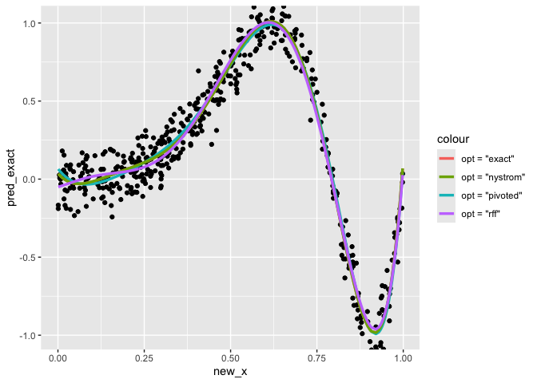

<!-- README.md is generated from README.Rmd. Please edit that file -->

# FastKRR

<!-- badges: start -->
<!-- badges: end -->

The ‘FastKRR’ implements its core computational operations in C++ via
‘RcppArmadillo’, enabling faster performance than pure R, improved
numerical stability, and parallel execution with OpenMP where available.
On systems without OpenMP support, the package automatically falls back
to single-threaded execution with no user configuration required. For
efficient model selection, it integrates with ‘CVST’ to provide
sequential-testing cross-validation that identifies competitive
hyperparameters without exhaustive grid search. The package offers a
unified interface for exact kernel ridge regression and three scalable
approximations—Nyström, Pivoted Cholesky, and Random Fourier
Features—allowing analyses with substantially larger sample sizes than
are feasible with exact KRR. It also integrates with the ‘tidymodels’
ecosystem via the ‘parsnip’ model specification ‘krr_reg’, the S3 method
‘tunable.krr_reg()’, and the direct fitting helper ‘fit_krr()’.

**Dependencies:** Rcpp, RcppArmadillo, CVST, parsnip  
This package uses **CVST** (GPL ≥ 2). Overall license: **GPL (≥ 2)**.

- Authors:
  - Gyeongmin Kim, Sungshin Women’s University,
    <rlarudals0824@gmail.com>
  - Seyoung Lee, Sungshin Women’s University, <sudang0404@gmail.com>
  - Miyoung Jang, Sungshin Women’s University, <miyoung9072@gmail.com>
  - Kwan-Young Bak, professor at Sungshin Women’s University,
    <kybak@sungshin.ac.kr>,
    [ORCID:0000-0002-4541-160X](https://orcid.org/0000-0002-4541-160X%7D%7BORCID:0000-0002-4541-160X)

## Installation

You can install the development version of FastKRR from
[GitHub](https://github.com/kybak90/FastKRR) with:

``` r
# install.packages("pak")
pak::pak("kybak90/FastKRR")
```

<!-- ## Parallelization -->
<!-- Some functions in **FastKRR** support parallel computation via OpenMP. -->
<!-- - On Windows and most Linux systems, OpenMP is available by default, and computations will use multiple threads. -->
<!-- - On macOS, if OpenMP is not installed, the package will run in single-threaded mode automatically. -->
<!-- No special installation steps are required. -->

## Example

This is a basic example of fitting a Gaussian kernel ridge regression
estimator to a dataset ${(x_i, y_i)}_{i=1}^n$ using (1) exact
computation, (2) pivoted Cholesky decomposition, (3) Nyström
approximation, and (4) random Fourier features.

``` r
library(FastKRR)

# example data set
set.seed(1)
n = 1000; d = 1
rho = 1
X = matrix(runif(n*d, 0, 1), nrow = n, ncol = d)
y = as.vector(sin(2*pi*rowMeans(X)^3) + rnorm(n, 0, 0.1))

# model fitting - exact
model_exact = fastkrr(X, y, kernel = "gaussian", rho = rho, opt = "exact", verbose = FALSE)

# model fitting - pivoted
model_pivoted = fastkrr(X, y, kernel = "gaussian", rho = rho, opt = "pivoted", verbose = FALSE)

# model fitting - nystrom
model_nystrom = fastkrr(X, y, kernel = "gaussian", rho = rho, opt = "nystrom", verbose = FALSE)

# model fitting - rff
model_rff = fastkrr(X, y, kernel = "gaussian", rho = rho, opt = "rff", verbose = FALSE)


# prediction
new_n = 500
new_x = matrix(runif(new_n*d, 0, 1), nrow = new_n, ncol = d)
new_y = as.vector(sin(2*pi*rowMeans(new_x)^3) + rnorm(new_n, 0, 0.1))

pred_exact = pred_krr(model_exact, new_x)
pred_pivoted = pred_krr(model_pivoted, new_x)
pred_nystrom = pred_krr(model_nystrom, new_x)
pred_rff = pred_krr(model_rff, new_x)
```

The visualization of the fitted results is shown below.

``` r
library(ggplot2)
data = data.frame(new_x, new_y)
data$pred_exact = as.numeric(pred_exact)
data$pred_pivoted = as.numeric(pred_pivoted)
data$pred_nystrom = as.numeric(pred_nystrom)
data$pred_rff = as.numeric(pred_rff)

ggplot(data = data, aes("x" = new_x, "y" = new_y)) +
  geom_point("x" = new_x, "y" = new_y) +
  geom_line(aes("x" = new_x, "y" = pred_exact, color = 'opt = "exact"'), linewidth=1.2) + 
  geom_line(aes("x" = new_x, "y" = pred_pivoted, color = 'opt = "pivoted"'),linewidth=1.2) + 
  geom_line(aes("x" = new_x, "y" = pred_nystrom, color = 'opt = "nystrom"'), linewidth=1.2) + 
  geom_line(aes("x" = new_x, "y" = pred_rff, color = 'opt = "rff"'), linewidth=1.2)
```



## OpenMP support on macOS

### 1) Install OpenMP runtime (Homebrew)

    # Ensure Command Line Tools (if not already installed)
    xcode-select --install || true

    # Install/update Homebrew libomp
    brew update
    brew install libomp

### 2) Configure `~/.R/Makevars` (works for Apple Silicon & Intel)

Copy the block below into `~/.R/Makevars` (create the file if it does
not exist).

    # OpenMP on macOS with Apple Clang 
    # Try to detect Homebrew prefix; fallback covers both Apple Silicon & Intel.
    HOMEBREW_PREFIX := $(shell brew --prefix 2>/dev/null)
    ifeq ($(strip $(HOMEBREW_PREFIX)),)
      HOMEBREW_PREFIX := /opt/homebrew
    endif

    # Include & lib paths (also add Intel path as extra fallback)
    CPPFLAGS  += -I$(HOMEBREW_PREFIX)/opt/libomp/include -I/usr/local/opt/libomp/include
    LDFLAGS   += -L$(HOMEBREW_PREFIX)/opt/libomp/lib     -L/usr/local/opt/libomp/lib

    # Standard R variables for OpenMP
    SHLIB_OPENMP_CFLAGS   = -Xpreprocessor -fopenmp
    SHLIB_OPENMP_CXXFLAGS = -Xpreprocessor -fopenmp
    SHLIB_OPENMP_FCFLAGS  = -fopenmp
    SHLIB_OPENMP_FFLAGS   = -fopenmp
    SHLIB_OPENMP_LIBS     = -lomp

> Restart R after editing `~/.R/Makevars` so the flags are picked up.

### 3) Install FastKRR

``` r
#pak::pak("kybak90/FastKRR")
library(FastKRR)
```

### 4) Example & OpenMP confirmation (inside FastKRR)

``` r
# example data set
set.seed(1)
n = 1000; d = 1
rho = 1
X = matrix(runif(n*d, 0, 1), nrow = n, ncol = d)
y = as.vector(sin(2*pi*rowMeans(X)^3) + rnorm(n, 0, 0.1))

# model fitting - nystrom
model_nystrom = fastkrr(X, y, kernel = "gaussian", rho = rho, opt = "nystrom", verbose = FALSE)

model_nystrom$n_threads    # >1 indicates OpenMP used by FastKRR (default 4)
#> [1] 1
```

### 5) Show that FastKRR links to libomp (macOS only)

The following code chunk inspects the dynamic libraries linked to the
compiled FastKRR shared object (`.so` or `.dylib`).

- If the output of `otool -L` contains a line with **`libomp.dylib`**,  
  then the package binary is linked against the OpenMP runtime and  
  **parallelization via OpenMP is available**.  
- If `libomp.dylib` is absent, the package was compiled without OpenMP
  support.

``` r
is_macos = (Sys.info()[["sysname"]] == "Darwin")

if (is_macos) {
  so_dir = system.file("libs", .Platform$r_arch, package = "FastKRR")
  if (so_dir == "") so_dir = system.file("libs", package = "FastKRR")
  so_files = list.files(so_dir, pattern = "\\.(so|dylib)$", full.names = TRUE)

  so = if (length(so_files)) so_files[[1]] else ""
  cat("FastKRR shared object:", so, "\n")

  if (nzchar(so)) {
    cmd = paste("otool -L", shQuote(so))
    cat(system(cmd, intern = TRUE), sep = "\n")
  } else {
    cat("No shared object found. Is FastKRR installed with compiled code?\n")
  }
} else {
  cat("Skipping otool check (not macOS).\n")
}
```

When you run this on macOS, a successful OpenMP build will show a line
such as:

    /Library/Frameworks/R.framework/Versions/4.3-arm64/Resources/lib/libomp.dylib

This confirms that OpenMP is enabled for FastKRR on your system.
